# DataCamp helpers

This is a Chrome Extension adding features that make the user experience on DataCamp even better.

## Features

### Copy course content to clipboard (as R Studio markdown)

A `copy to clipboard` button is added to the currently visited subsite of any DataCamp course. It allows you to get the relevant content of the page, formatted as markdown that you may copy into R Studio directly. This can be useful for creating documents summarizing what you have learnt. Several sub-sites are supported. Lists, code blocks, inline code, or even LaTeX are pre-formatted accordingly as well.

#### Code exercises

The exercise description + instructions are copied. Use the `include code output?` checkbox to control whether the code should be copied as executable R markdown code blocks, or as code blocks with `EVAL = FALSE` with the output from the R session in DataCamp copied instead. Hitting the `copy` button also submits the code per default. The script then tries to submit all sub-exercises at once (if there are any) and copy the results together into nicely formatted markdown. See an example of the behavior below:

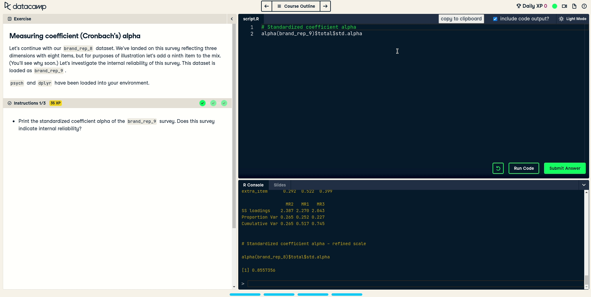

You can tweak many aspects of the code copying behavior. Because of time constraints this is not yet configurable via UI, but only by changing the `codeExerciseConfig` in `src/feature-modules/copy-helper/index.js`.

#### Course overview

The course description + all chapter descriptions are copied. Furthermore, a YAML header with sensible defaults for creating PDF output from the R markdown document is generated:

#### Video exercises

The contents of all the slides are copied (including formatted code, tables, lists etc.):

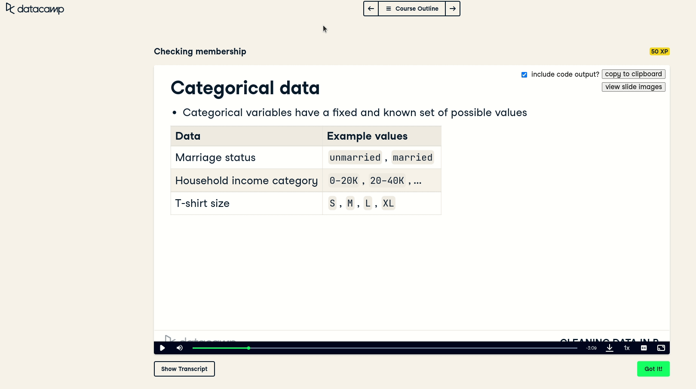

Unfortunately, images cannot be copied in the same step. You may however use the slide image viewer to view the images and copy them separately.

#### Drag-drop exercises

Two types of drag-drop exercises are supported:

1.  Drag-into-correct-bucket-exercises:

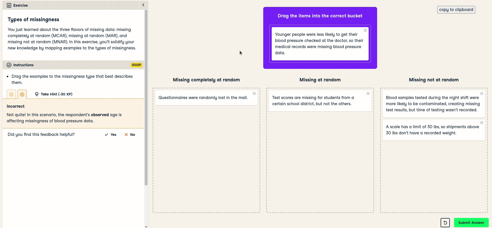

2.  Drag-into-order-exercises:

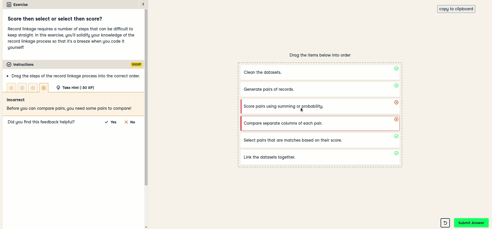

### Code quick-copy

No more tedious typing of the same variable/function names across several exercises: just paste them into the editor by clicking on them in the exercise description!

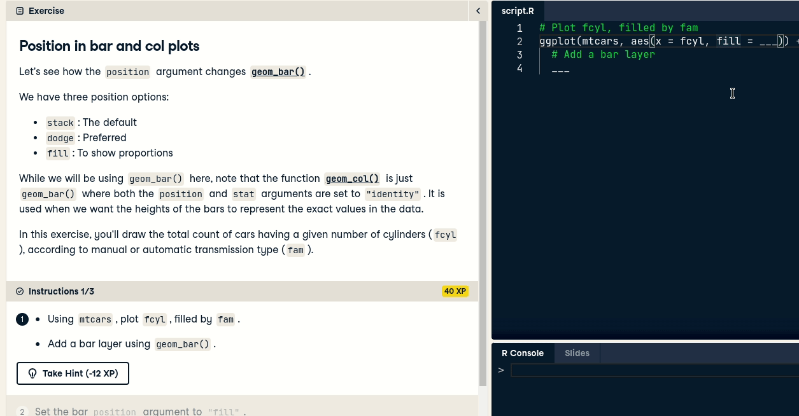

### Keyboard shortcuts

This script adds several kinds of (more or less) useful keyboard shortcuts.

#### Code editor shortcuts

One can use the following shortcuts in the code editor (which are probably known to R Studio users):

| **Key combination**           | **Output** |
| ----------------------------- | ---------- |
| <kbd>Alt</kbd> + <kbd>-</kbd> | `<-`       |
| <kbd>Alt</kbd> + <kbd>.</kbd> | `%>%`      |
| <kbd>Alt</kbd> + <kbd>i</kbd> | `%in%`     |

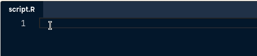

#### Fixes for existing shortcuts

This extension fixes many of DataCamp's built-in shortcuts. They don't work well out of the box as they clash with default browser key combinations and apparently this was not handled appropriately by the devs of the DataCamp web app.

Navigate through exercises with <kbd>Ctrl</kbd> + <kbd>J</kbd> and <kbd>Ctrl</kbd> + <kbd>K</kbd>:

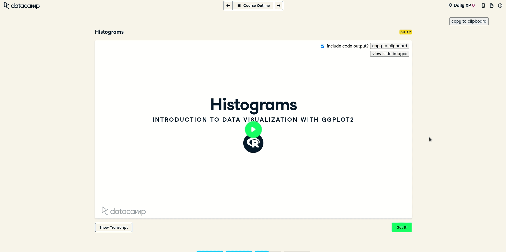

The experience with video pages is improved as well (<kbd>Ctrl</kbd> + <kbd>J</kbd>, <kbd>Ctrl</kbd> + <kbd>K</kbd>, and <kbd>Ctrl</kbd> + <kbd>O</kbd> also work while the video is focused).

#### Additional shortcuts

Focus into videos on the video page by pressing <kbd>F</kbd>, leave focus with <kbd>ESC</kbd>.

You can also use <kbd>Alt</kbd> + <kbd>E</kbd> to focus into the code editor at any time while on a code exercise page.

Use <kbd>Ctrl</kbd> + <kbd>Shift</kbd> + <kbd>J</kbd> and <kbd>Ctrl</kbd> + <kbd>Shift</kbd> + <kbd>K</kbd> to cycle through sub-exercises of a code exercise:

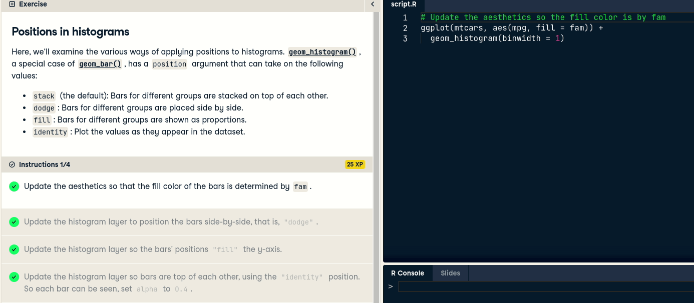

Toggle the course overview modal (open with <kbd>Ctrl</kbd> + <kbd>O</kbd>, close by hitting <kbd>ESC</kbd>):

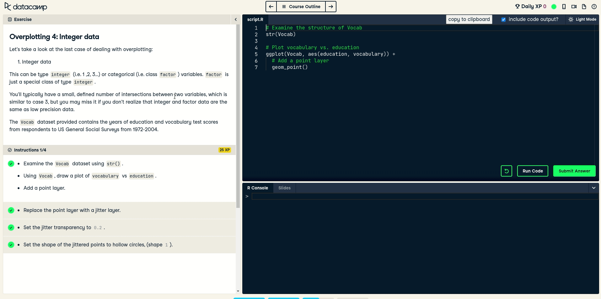

### Video slide helpers

#### Quickly skip through slides

In every demonstration video, you may skip through the slides used in the video, either with the buttons, or using <kbd>Ctrl</kbd> + <kbd>Shift</kbd> + <kbd>J</kbd> and <kbd>Ctrl</kbd> + <kbd>Shift</kbd> + <kbd>K</kbd>. The video is then automatically forwarded to the timestamps where the slides appear:

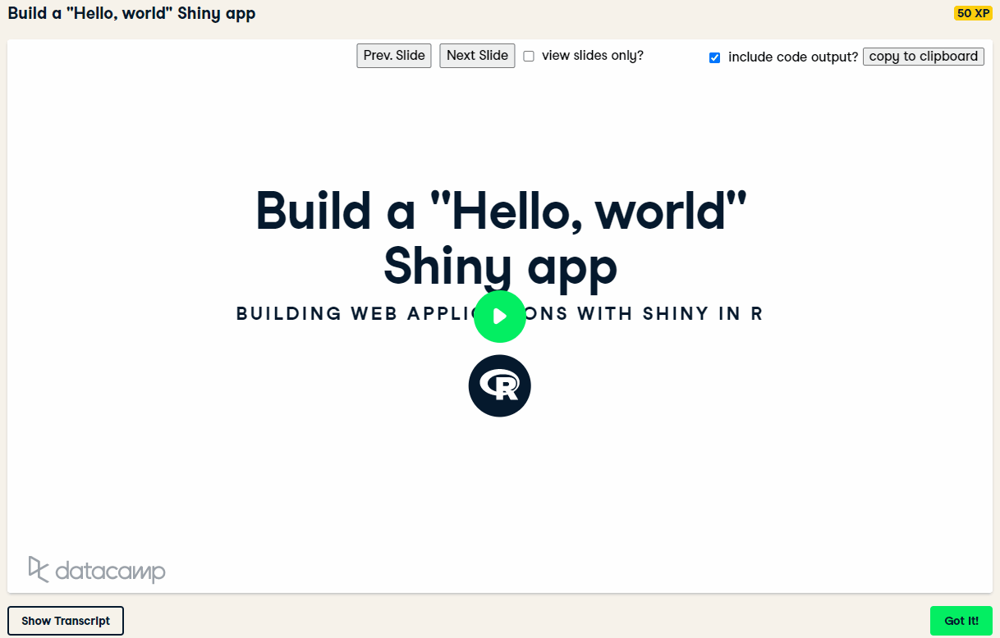

#### View slides outside video, copy content

Furthermore, you may choose to view only the slides (without the video). You can then also copy the slide content (text, code, and also images) as you wish!

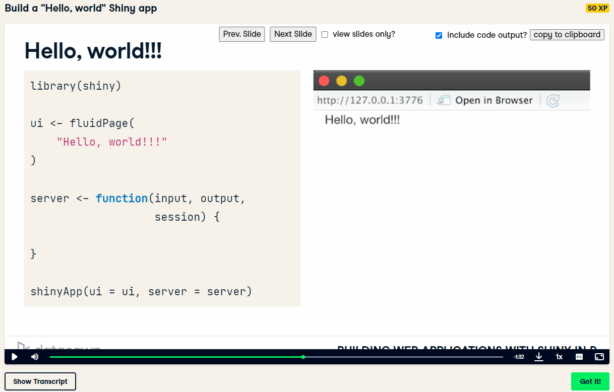

## Installation

As this Chrome Extension has not been published in the Chrome Store, you need to clone its repo (or download the code) and install it in developer mode.

Instructions:

1. Get the code (by cloning this repo or downloading and unzipping)
2. Go to `chrome://extensions`
3. Make sure Developer mode is on (switch in the upper-right corner)
4. Click on `Load unpacked`
5. Choose folder containing code

## WHY?

I created this extension solely for the purpose of reducing time spent with dumb copy-pasting in a course of the Data Science Master's degree at TU Wien. There, we had an extremely lazy lecturer who basically just gave us a list of DataCamp courses that we should take. For each of those courses, we were tasked with creating a R Markdown file, were we essentially just had to copy all the stuff we did and explain what the code does. (btw, I'm aware that implementing this solution was probably 10x as much work as doing the stupid manual copy-pasting work, but at least I had fun haha)

Over the course of the semester, I kept on working on this "copy-helper script", and added additional features I considered useful.

## Lessons learned

I used this project to explore things one can do with vanilla JavaScript. Initially, this project was a single huuuuge TamperMonkey user script. Later I converted it into a Chrome extension, trying to make use of the native ES6 module system instead of relying on Webpack or other build tools. This was still kind of a pain, so probably for my next project I will use TypeScript and other more convenient alternatives, including React or some other frontend framework.
